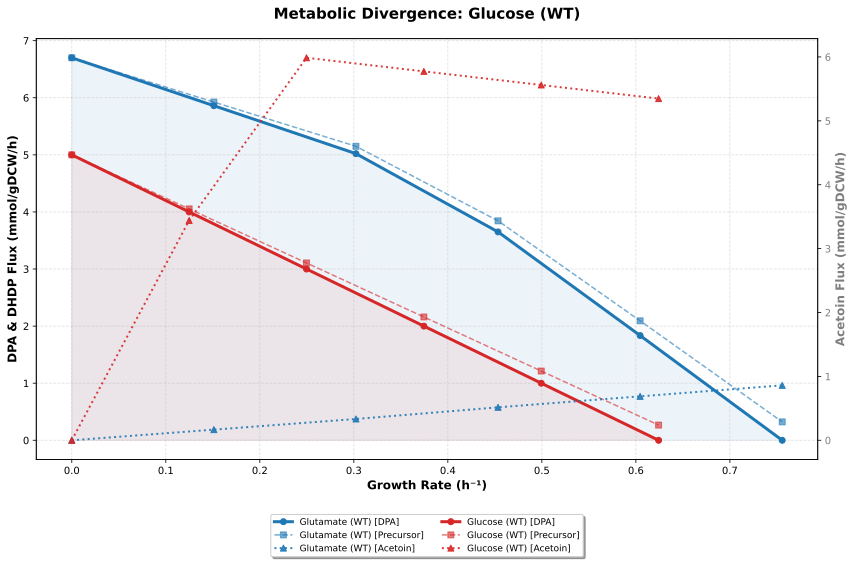
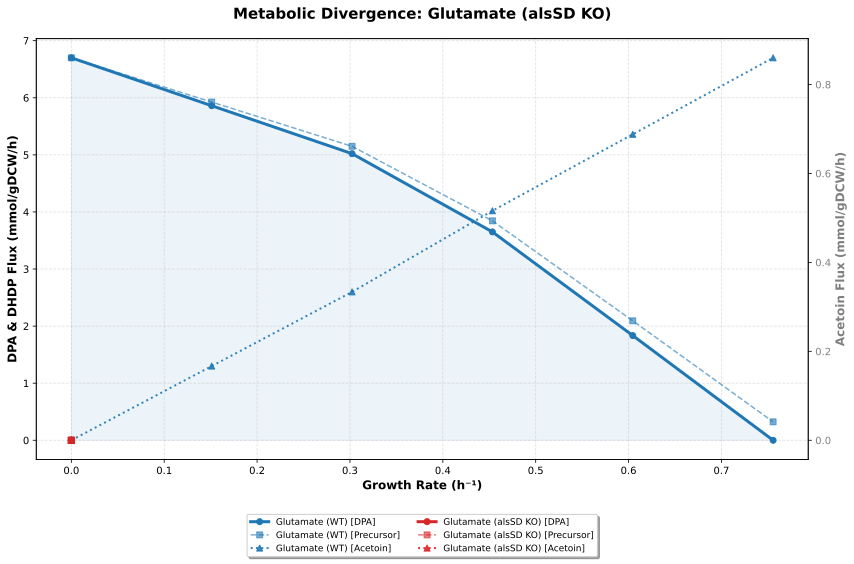
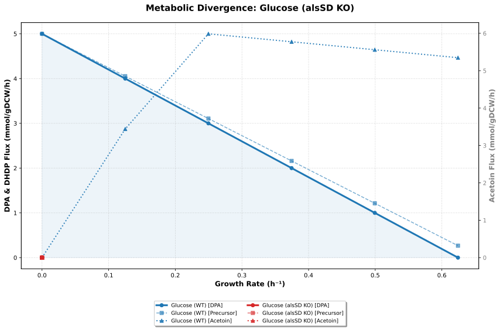
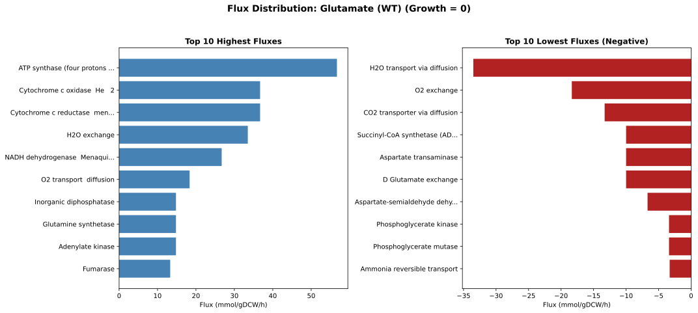
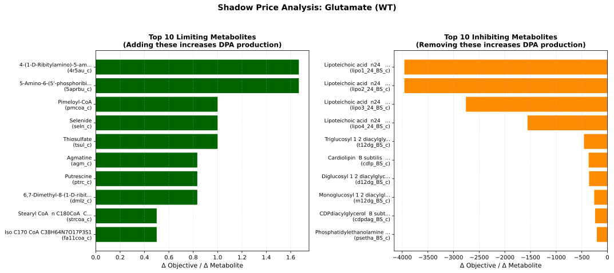
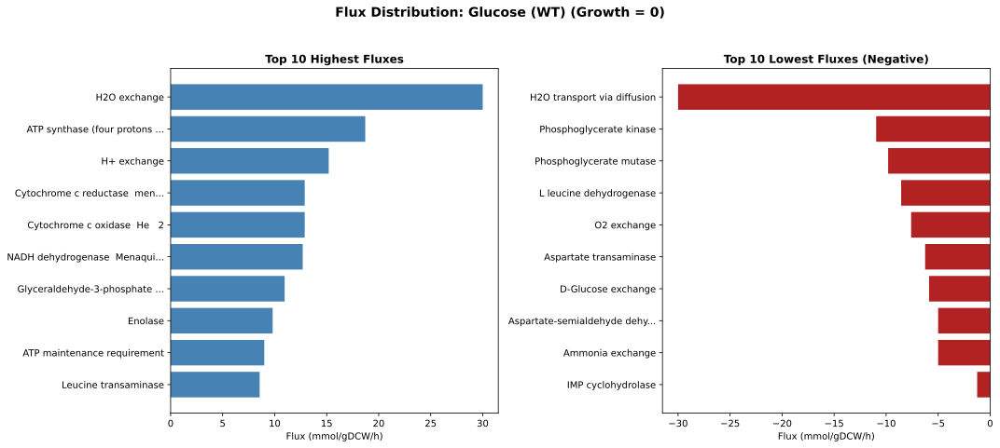
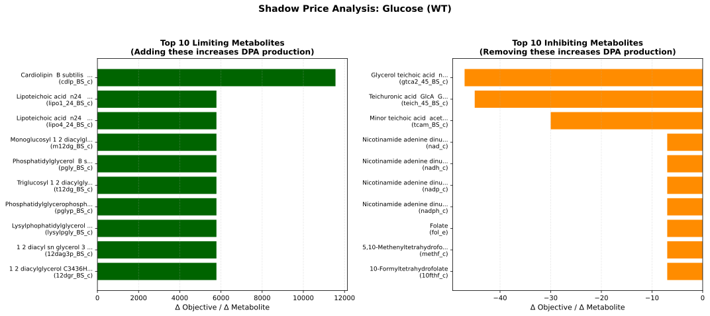

# Metabolic Engineering for DPAHelix Project

This repository contains one of the five computational biology analyses conducted for the DPAHelix project as part of the GOGEC Competition 2026.

> **Objective**: Optimize the production of DPA (Dipicolinic Acid) through metabolic engineering.

The initial model development was performed using Google Colab notebooks. Significant updates and the final code were subsequently integrated into this repository.

- **DPAHelix Members involved (No specific order)**: Alison Yuliana Anaya Quintero, Melissa Yoely Santayygo Acosta
- **Advisor**: LBG Mauricio Reyes-Elizondo
- **PI**: Dr J Claudio Moreno-Rocha

## Databases Used
1. **KEGG**: https://www.kegg.jp/
2. **BioCyc**: https://biocyc.org/
3. **EMBL-EBI BioModels**: https://www.ebi.ac.uk/biomodels/
4. **BiGG**: http://bigg.ucsd.edu/

## Python Library
- **COBRApy**: https://cobrapy.readthedocs.io/en/latest/index.html

## Model Selection
We selected the following metabolic model from BiGG:
> *Bacillus subtilis* subsp. *subtilis* str. 168: http://bigg.ucsd.edu/models/iYO844

**Model Statistics**:
- **Genome NCBI ID**: AL009126.3
- **Metabolites**: 990
- **Reactions**: 1,250
- **Genes**: 844

### Model Download
The model was downloaded using the following commands:
```shell
!mkdir model/
!wget "http://bigg.ucsd.edu/static/models/iYO844.xml" -O "model/iYO844.xml"
```

The complete workflow is available in `MetabolicAnalysis.ipynb` within this repository.

## Specific Objectives & Activities

### Objective 1
Identify the potential DPA production rate in *B. subtilis* during the stationary phase using glutamate and glucose as substrates.

> **Note**: An additional analysis of the DHDP precursor was conducted to support genetic circuit analysis via differential equations (in a separate repository).

### Objective 2
Identify potential carbon flux deviations in acetoin biosynthesis.

### Objective 3
Identify key metabolic fluxes with the lowest and highest impact on DPA production (Reduced Costs Analysis).

### Objective 4
Identify key precursors with the lowest and highest impact on DPA production (Shadow Price Analysis).

## Analysis Description

We evaluated the relationship between the **growth rate (h⁻¹)** and **DPA production (mmol gDW⁻¹ h⁻¹)** under two conditions:
- A glucose-specific medium (10 mmol)
- A glutamate-specific medium (10 mmol)

During simulations, we monitored the activity of reactions associated with the *alsSD* genes:
- **ACLS** and **ACHBS** for *alsS*
- **ACLDC** for *alsD*

These reactions belong to the **Acetoin Biosynthesis** pathway. We simulated:
- **Knockout (KO)**: Reaction boundaries set to 0.
- **Knockdown (KD)**: Reaction boundaries reduced to 25% of wild-type (WT) activity.

An additional analysis of **DHDP** (a DPA precursor in the model) was performed to inform genetic circuit differential equation modeling (in a separate repository).

---

## Results

### Plot 1: `output/glucose_vs_glutamate_production_rates.svg`


**Metabolic divergence between glucose and glutamate.** The highest growth rate was observed with glucose.

**Glucose (WT) Results**:
```
--- Influence Analysis at Growth = 0 ---
Max Theoretical DPA Production: 5.0000

--- Computing Production Envelope ---
Growth: 0.0000 | DPA: 5.0000 | DHDP Synth: 5.0000 | Acetoin Activity: 0.0000
Growth: 0.1248 | DPA: 4.0000 | DHDP Synth: 4.0533 | Acetoin Activity: 3.4409
Growth: 0.2497 | DPA: 3.0000 | DHDP Synth: 3.1066 | Acetoin Activity: 5.9868
Growth: 0.3745 | DPA: 2.0000 | DHDP Synth: 2.1600 | Acetoin Activity: 5.7739
Growth: 0.4993 | DPA: 1.0000 | DHDP Synth: 1.2133 | Acetoin Activity: 5.5610
Growth: 0.6242 | DPA: 0.0000 | DHDP Synth: 0.2666 | Acetoin Activity: 5.3480
```

**Glutamate (WT) Results**:
```
--- Influence Analysis at Growth = 0 ---
Max Theoretical DPA Production: 6.7000

--- Computing Production Envelope ---
Growth: 0.0000 | DPA: 6.7000 | DHDP Synth: 6.7000 | Acetoin Activity: 0.0000
Growth: 0.1511 | DPA: 5.8603 | DHDP Synth: 5.9248 | Acetoin Activity: 0.1668
Growth: 0.3023 | DPA: 5.0205 | DHDP Synth: 5.1496 | Acetoin Activity: 0.3337
Growth: 0.4534 | DPA: 3.6502 | DHDP Synth: 3.8438 | Acetoin Activity: 0.5160
Growth: 0.6045 | DPA: 1.8345 | DHDP Synth: 2.0927 | Acetoin Activity: 0.6880
Growth: 0.7557 | DPA: -0.0000 | DHDP Synth: 0.3228 | Acetoin Activity: 0.8600
```

> **Note 1**: All knockout simulations were categorized as lethal for the model.
> **Note 2**: All knockdown simulations (25% activity) showed no significant influence on DPA production at any growth rate.

### Additional Plots
**Plot 2**: `output/glutamate_wt_and_ko_production_rates.svg`



DPA production under WT and KO conditions for glutamate.

**Plot 3**: `output/glucose_wt_and_ko_production_rates.svg`



DPA production under WT and KO conditions for glucose.

### Flux and Shadow Price Analysis
We identified key metabolic fluxes and shadow prices with the highest and lowest impact on DPA production in WT strains (glutamate and glucose) at a **growth rate = 0**.

**Plot 4**: `output/glutamate_wt_reaction_fluxes.svg`



Top 10 highest and lowest reaction fluxes for glutamate.

**Plot 5**: `output/glutamate_wt_shadow_prices.svg`



Top 10 highest and lowest shadow prices for glutamate.

**Plot 6**: `output/glucose_wt_reaction_fluxes.svg`



Top 10 highest and lowest reaction fluxes for glucose.

**Plot 7**: `output/glucose_wt_shadow_prices.svg`



Top 10 highest and lowest shadow prices for glucose.

All plots are available in the `output/` folder and are organized within the `MetabolicAnalysis.ipynb` notebook.

## END